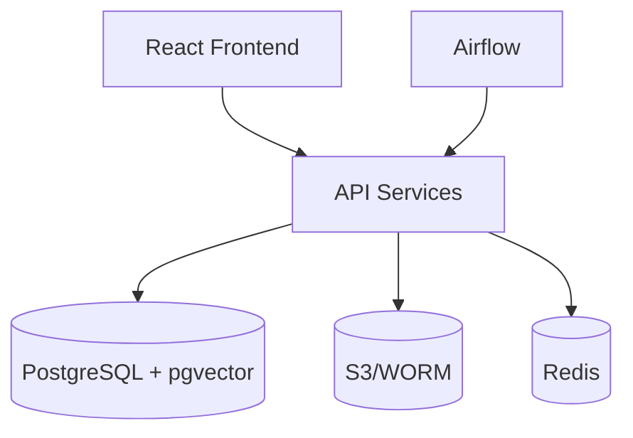

# Aura Audit AI - Architecture

## System Context

Aura Audit AI is an enterprise audit platform with:
- **Ingestion**: EDGAR/XBRL, PBC uploads, ERP connectors
- **Analytics**: JE testing, anomaly detection, ratios
- **AI/LLM**: RAG-powered disclosure drafting with citations
- **Engagement Management**: Cloud binder, workflows, review notes
- **Compliance**: WORM storage, QC gates, e-signature

## Container Diagram

## Key Services
1. **Ingestion** (8001): EDGAR, PBC, TB import
2. **Normalize** (8002): Taxonomy mapping
3. **Analytics** (8003): JE tests, ratios
4. **LLM** (8004): RAG retrieval
5. **Engagement** (8005): Binder, workpapers
6. **Disclosures** (8006): AI note drafting
7. **Reporting** (8007): PDF + e-sign
8. **QC** (8008): Policy checks
9. **Identity** (8009): OIDC/RBAC
10. **Connectors** (8010): ERP integrations

## Security
- **Auth**: OIDC (Azure AD/Okta) + JWT
- **Authz**: RBAC + Postgres RLS (engagement-level)
- **Encryption**: TLS 1.3, KMS at rest
- **Audit Trail**: OpenLineage events

## Compliance
- **PCAOB AS 1215**: 7-year WORM retention
- **AICPA SAS 142/145**: Evidence links, risk documentation
- **SEC 17 CFR 210.2-06**: Immutable archives

See openapi/atlas.yaml for API contracts.
