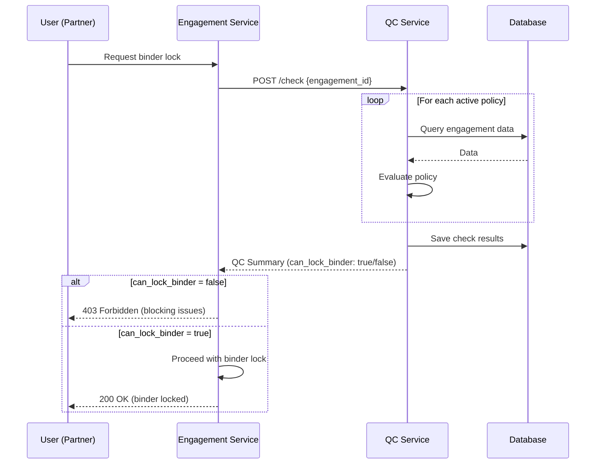

# QC Service - Quality Control & Compliance Gates

**Purpose**: Enforce audit standards and firm policies before engagement finalization

**Critical**: This service provides BLOCKING gates that prevent binder finalization until all compliance requirements are met. No automated report issuance - human-in-the-loop required.

---

## 📋 Compliance Coverage

### Regulatory Standards

| Standard | Description | Requirement | Blocking |
|----------|-------------|-------------|----------|
| **PCAOB AS 1215** | Audit Documentation | All procedures must have supporting workpapers | ✅ YES |
| **AICPA SAS 142** | Audit Evidence | Sufficient appropriate evidence for material accounts | ✅ YES |
| **AICPA SAS 145** | Risk Assessment | All risks must have linked procedures; fraud risks documented | ✅ YES |
| **SEC 17 CFR 210.2-06** | Retention | 7-year retention enforced (by Reporting service) | N/A |

### Firm Policies

| Policy | Description | Blocking |
|--------|-------------|----------|
| **Partner Sign-Off** | Partner must review and e-sign before finalization | ✅ YES |
| **Review Notes Cleared** | All blocking review notes must be addressed | ✅ YES |
| **Material Accounts Coverage** | All material accounts must be tested | ✅ YES |
| **Subsequent Events** | Subsequent events review performed | ⚠️ NO (informational) |

---

## 🔒 How It Works

### 1. **Policy Registration**

Policies are registered at service startup:

```python
from app.policies import PolicyRegistry, AS1215_AuditDocumentation

registry = PolicyRegistry()
registry.register(AS1215_AuditDocumentation())
```

### 2. **Policy Evaluation**

Each policy implements `evaluate()` method:

```python
class AS1215_AuditDocumentation(BasePolicy):
    async def evaluate(self, engagement_id: UUID, db: AsyncSession) -> Dict:
        # Check if all procedures have workpapers
        undocumented = await count_undocumented_procedures(engagement_id, db)

        if undocumented > 0:
            return {
                "passed": False,
                "details": f"{undocumented} procedures lack workpapers",
                "remediation": "Complete workpapers per PCAOB AS 1215...",
                "evidence": {"undocumented_count": undocumented}
            }

        return {"passed": True, "details": "All documented", ...}
```

### 3. **Pre-Finalization Check**

Before binder can be locked, QC checks must pass:

```bash
POST /qc/check
{
  "engagement_id": "uuid"
}

Response:
{
  "can_lock_binder": false,  # ← BLOCKS finalization
  "blocking_failed": 2,
  "checks": [
    {
      "policy_code": "PARTNER_SIGN_OFF",
      "passed": false,
      "is_blocking": true,
      "details": "Partner sign-off not obtained",
      "remediation": "Engagement partner must review..."
    },
    {
      "policy_code": "AS1215_DOCUMENTATION",
      "passed": false,
      "is_blocking": true,
      "details": "5 procedures lack workpapers",
      "remediation": "Complete workpapers per PCAOB AS 1215..."
    }
  ]
}
```

---

## 🚀 API Endpoints

### Run QC Checks (Primary Endpoint)

```bash
POST /check
Content-Type: application/json

{
  "engagement_id": "uuid"
}
```

**Returns**: Complete QC results with `can_lock_binder` flag

**Called by**: Engagement service before state transition to "Finalized"

### Get Latest QC Status

```bash
GET /engagements/{engagement_id}/checks/latest
```

**Returns**: Most recent QC check summary

**Called by**: Frontend to display QC status dashboard

### List Policies

```bash
GET /policies
GET /policies?is_blocking=true
GET /policies?is_active=true
```

**Returns**: All QC policies with metadata

### Waive Failed Check (Partner Only)

```bash
POST /engagements/{engagement_id}/checks/{check_id}/waive
Content-Type: application/json

{
  "waiver_reason": "Compensating controls performed due to..."
}
```

**Requires**: Partner role
**Effect**: Waived checks don't block finalization but are recorded for peer review

---

## 🧪 Testing

### Run Unit Tests

```bash
cd services/qc
pytest tests/unit/test_policies.py -v --cov=app.policies

# Expected output: 20+ tests passed
```

### Test Coverage

- ✅ Policy registration and retrieval
- ✅ Policy attribute validation
- ✅ PCAOB AS 1215 evaluation
- ✅ AICPA SAS 142 evaluation
- ✅ AICPA SAS 145 evaluation
- ✅ Partner sign-off check
- ✅ Review notes check
- ✅ Material accounts coverage
- ✅ Subsequent events (non-blocking)
- ✅ Error handling
- ✅ Compliance standards coverage

### Integration Testing (TODO)

```bash
# Full workflow test
1. Create engagement
2. Add procedures without workpapers
3. Run QC check → FAIL
4. Add workpapers
5. Run QC check → PASS
6. Lock binder → SUCCESS
```

---

## 📊 Architecture

### Policy Evaluation Flow



### Database Schema

```sql
-- QC policies (pre-seeded)
CREATE TABLE atlas.qc_policies (
    id UUID PRIMARY KEY,
    policy_code VARCHAR(100) UNIQUE NOT NULL,
    policy_name VARCHAR(200) NOT NULL,
    is_blocking BOOLEAN NOT NULL DEFAULT TRUE,
    standard_reference VARCHAR(100),
    check_logic JSONB NOT NULL,
    is_active BOOLEAN NOT NULL DEFAULT TRUE
);

-- QC check results
CREATE TABLE atlas.qc_checks (
    id UUID PRIMARY KEY,
    engagement_id UUID NOT NULL,
    policy_id UUID REFERENCES atlas.qc_policies(id),
    executed_at TIMESTAMPTZ NOT NULL,
    status VARCHAR(20) NOT NULL,  -- 'passed', 'failed', 'waived'
    result_data JSONB,
    waived_by UUID,
    waived_at TIMESTAMPTZ,
    waiver_reason TEXT
);
```

---

## 🔐 Security & Compliance

### Audit Trail

All QC checks are logged:
- ✅ When checks were run
- ✅ Who ran them
- ✅ Results (passed/failed/waived)
- ✅ Evidence supporting each result
- ✅ Waivers with justification

### Waivers

Partner-level waivers are allowed but:
- ✅ Require written justification (min 10 characters)
- ✅ Recorded in database with user ID, timestamp, reason
- ✅ Included in peer review documentation
- ✅ Subject to PCAOB inspection

### Immutability

Once binder is locked:
- ✅ QC check results are immutable
- ✅ Cannot retroactively change pass/fail
- ✅ Waivers cannot be removed
- ✅ Full audit trail preserved for 7+ years

---

## 📖 Policy Implementation Guide

### Adding a New Policy

1. **Create policy class**:

```python
# app/policies.py
class MyNewPolicy(BasePolicy):
    def __init__(self):
        super().__init__()
        self.policy_code = "MY_POLICY"
        self.policy_name = "My Policy Name"
        self.is_blocking = True
        self.standard_reference = "Standard XYZ"

    async def evaluate(self, engagement_id, db):
        # Your check logic here
        return {
            "passed": True/False,
            "details": "...",
            "remediation": "...",
            "evidence": {...}
        }
```

2. **Register in main.py**:

```python
policy_registry.register(MyNewPolicy())
```

3. **Write tests**:

```python
# tests/unit/test_policies.py
class TestMyNewPolicy:
    def test_policy_attributes(self):
        policy = MyNewPolicy()
        assert policy.policy_code == "MY_POLICY"
        assert policy.is_blocking is True

    @pytest.mark.asyncio
    async def test_evaluate(self):
        policy = MyNewPolicy()
        result = await policy.evaluate(uuid4(), AsyncMock())
        assert "passed" in result
```

4. **Seed in database**:

```sql
INSERT INTO atlas.qc_policies (
    policy_code, policy_name, is_blocking,
    standard_reference, check_logic
) VALUES (
    'MY_POLICY', 'My Policy Name', true,
    'Standard XYZ', '{"check": "my_check"}'::jsonb
);
```

---

## 🚨 Troubleshooting

### QC checks always pass (no database queries)

**Current status**: Policy evaluation logic is implemented but not yet connected to real database queries. Policies return mock results.

**Solution**: Implement actual SQL queries in each policy's `evaluate()` method.

Example:
```python
async def evaluate(self, engagement_id, db):
    # Query actual data
    result = await db.execute(
        select(func.count()).select_from(Procedure)
        .where(Procedure.engagement_id == engagement_id)
        .where(Procedure.workpaper_count == 0)
    )
    undocumented = result.scalar()

    if undocumented > 0:
        return {"passed": False, ...}
```

### Waiver doesn't unblock finalization

Check:
1. Is waiver recorded in database? (`qc_checks.status = 'waived'`)
2. Is `can_lock_binder` calculation correct? (should ignore waived checks)
3. Are there other failing blocking checks?

### Policy not running

Check:
1. Is policy registered in `main.py`?
2. Is policy active in database? (`qc_policies.is_active = true`)
3. Check logs for evaluation errors

---

## 🎯 Next Steps

### Phase 1: Database Integration (1 day)
- [ ] Implement SQL queries in each policy
- [ ] Test with real engagement data
- [ ] Verify blocking logic works end-to-end

### Phase 2: Advanced Policies (2 days)
- [ ] Materiality calculations
- [ ] Analytical procedure coverage
- [ ] Sampling adequacy
- [ ] Going concern assessment

### Phase 3: Reporting (1 day)
- [ ] QC dashboard for partners
- [ ] Firm-wide compliance reports
- [ ] Trend analysis (pass rates over time)
- [ ] Peer review readiness report

---

## 📚 References

- [PCAOB AS 1215 - Audit Documentation](https://pcaobus.org/oversight/standards/auditing-standards/details/AS1215)
- [AICPA SAS 142 - Audit Evidence](https://www.aicpa.org/resources/article/understanding-sas-no-142-audit-evidence)
- [AICPA SAS 145 - Risk Assessment](https://www.aicpa.org/resources/article/understanding-sas-145-understanding-the-entity-and-assessing-the-risks-of-material-misstatement)
- [SEC Retention Requirements](https://www.sec.gov/rules/final/33-8180.htm)

---

**Built with compliance-first design** 🔒
